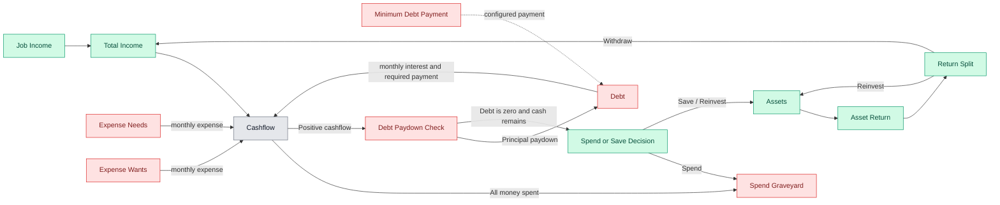

# Cash Flow Animation

A playable simulator that shows how money moves through a person’s financial life over time.

The model treats income, expenses, debt, and assets as nodes in a directed flow graph. Dollars move between nodes each period, making it easy to visualize:

- where money comes from
- where money gets consumed
- when debt grows or shrinks
- when surplus cash becomes savings or spending
- how assets can feed future income and compound over time

## Chosen v1 direction

### Product shape

- **Format:** playable simulator
- **Delivery:** **web app with SVG-based visualization**
- **Suggested implementation:** plain **HTML + CSS + JavaScript + SVG**
- **Time step:** **monthly**

This is the best fit for a first version because it is interactive, visual, easy to share, and easy to refine.

## Core idea

### Income sources

- **Job Income** → earned income from work
- **Asset Withdrawal** → the configurable portion of asset return that is withdrawn into spendable income
- **Total Income** → combines all inflows before spending decisions

### Outflows

- **Expense Needs** → rent, groceries, utilities, insurance, transportation
- **Expense Wants** → entertainment, travel, eating out, hobbies
- **Minimum Debt Payment** → required debt servicing each period

### Net result

- **Cashflow** = `Total Income - Needs - Wants - Minimum Debt Payment`

From there:

- If **Cashflow < 0**, debt increases
- If **Cashflow > 0** and debt exists, surplus first pays down debt
- If **Cashflow > 0** and debt is gone, surplus is split between:
  - **Spend**
  - **Save / Reinvest**

### Assets

Assets are represented as a **single bucket** in v1.

Each period:

1. Assets generate a **total return**
2. That return goes to a **Return Split** node
3. The return is split into:
   - **Withdraw** → flows into **Total Income**
   - **Reinvest** → flows back into **Assets**

This creates the compounding loop:

`Surplus Cash -> Assets -> Total Return -> Reinvest -> Assets`

And the income loop:

`Assets -> Total Return -> Withdraw -> Total Income`

## Explicit v1 decisions

- **Taxes:** omitted for simplicity
- **Debt:** single bucket
- **Assets:** single bucket
- **Asset income vs appreciation:** combined into a single **total return** value
- **Withdraw vs reinvest ratio:** configurable
- **Save vs spend ratio:** configurable
- **Life events:** not included in v1
- **Spend Graveyard:** consumption permanently leaves the system
- **When debt is fully paid mid-period:** any remaining surplus follows the spend/save split in the same period
- **Delivery:** static, client-only web application; no login, API, backend, or data sharing
- **Browser support:** current Chrome, Safari, and Edge; responsive down to mobile widths
- **Implementation:** framework-free HTML, CSS, modular JavaScript, and SVG; no build step required

## Implementation contract

These rules make the simulation deterministic and define the intended v1 behavior.

### Values, rates, and timing

- Money is stored internally as integer cents and displayed as currency rounded to two decimal places.
- Debt interest and asset-return inputs are annual percentages and are converted to monthly rates by dividing by 12.
- Percentage inputs accept decimal values such as `7.5%`.
- Each month uses the opening debt and asset balances to calculate that month's interest and return.
- Money added to Assets during a month begins earning returns in the following month.
- Assets and Debt are never allowed to become negative.
- Asset returns may be negative. A negative return reduces Assets; it produces no withdrawal income and no reinvestment flow.
- Asset withdrawals are limited to the positive return generated that month; v1 never sells asset principal.

### Monthly processing order

1. Calculate the positive or negative Asset Return from opening Assets.
2. Split a positive return into Withdraw and Reinvest portions.
3. Add Job Income and the Withdraw portion to Total Income.
4. Accrue Debt interest from opening Debt.
5. Apply the Minimum Debt Payment, capped at the debt balance after interest.
6. Calculate Cashflow as `Total Income - Needs - Wants - actual Minimum Debt Payment`.
7. If Cashflow is negative, add its absolute value to Debt.
8. If Cashflow is positive and Debt remains, apply as much as needed as extra Debt Paydown.
9. If a positive remainder remains after Debt reaches zero, split it between Spend and Save / Reinvest in the same month.
10. Add Reinvested Asset Return and Save / Reinvest surplus to Assets for the next month.

This model intentionally permits a cash shortfall to fund the configured minimum debt payment by borrowing: the resulting negative Cashflow is added back to Debt.

### Inputs, reset, and persistence

- The first-load default scenario is: Job Income `$5,000/month`; Needs `$2,000/month`; Wants `$800/month`; starting Debt `$18,000`; annual Debt Interest `18%`; Minimum Debt Payment `$400/month`; starting Assets `$12,000`; annual Asset Return `7%`; Return Split `30% withdraw / 70% reinvest`; Surplus Split `20% spend / 80% save`.
- Input edits apply to the next simulated month without rewriting past results.
- **Reset simulation** returns to month zero and the opening balances using the current input values.
- **Reset defaults** restores the documented default scenario and clears saved settings.
- Settings persist in browser local storage after refresh.
- Currency inputs must be non-negative. Allocation inputs (withdraw/reinvest and save/spend) must be from 0% through 100%.

### Graph and animation semantics

- Every proposed v1 node is visible, including Cashflow, Return Split, Debt Paydown, and Spend or Save Decision.
- Edges describe accounting relationships. Animated particles show the economic direction of money, so obligations visually move from the available-income/cashflow side toward their destination.
- The Minimum Debt Payment node represents an obligation/calculation input, not a source of dollars.
- Zero-value edges retain a muted `$0.00` label so the graph stays stable, but have no animated particles.
- Each simulated month completes its animation before Play advances to the next month.
- Play offers 1×, 2×, and 4× speeds; Pause stops after the current animation frame; Step advances one animated month.
- A reduced-motion preference updates a month without particle animation.

### Quality bar

- A documented default scenario is shown on first load.
- Summary metrics, node balances, edge labels, and graph animation update after every month.
- Controls are keyboard-accessible and inputs have visible labels.
- The simulation engine is separate from the SVG/UI and has unit tests covering returns, debt interest, minimum-payment capping, deficits, debt payoff with same-month remainder, and allocation splits.

## Proposed v1 nodes

### Required nodes

1. **Job Income**
2. **Assets**
3. **Asset Return**
4. **Return Split**
5. **Total Income**
6. **Expense Needs**
7. **Expense Wants**
8. **Debt**
9. **Minimum Debt Payment**
10. **Cashflow**
11. **Debt Paydown Check**
12. **Spend or Save Decision**
13. **Spend Graveyard**

## Flow rules

## 1. Income generation

- `Job Income -> Total Income`
- `Assets -> Asset Return -> Return Split`
- `Return Split (withdraw portion) -> Total Income`
- `Return Split (reinvest portion) -> Assets`

## 2. Spending obligations

- `Expense Needs -> Cashflow`
- `Expense Wants -> Cashflow`
- `Minimum Debt Payment -> Cashflow`

In the animation, these are negative flows pulling against income.

## 3. Net cashflow calculation

- `Total Income -> Cashflow`

Interpretation:

- positive cashflow = surplus dollars
- negative cashflow = deficit dollars

## 4. Debt interest and minimum payment

Debt is a single running balance.

Each period:

1. Debt accrues interest
2. The required minimum payment is applied
3. Remaining positive cashflow, if any, goes to extra paydown before any new saving or discretionary spending

## 5. Negative cashflow behavior

If cashflow is negative:

- the absolute value is added to the Debt balance by the monthly calculation

This means the person borrows to cover the shortfall. It is a balance update, not a third visible output from the Cashflow node.

## 6. Positive cashflow behavior

If cashflow is positive and debt exists:

- `Cashflow (positive) -> Debt Paydown Check -> Debt`

This reduces debt principal.

If debt is fully paid and positive cash remains in that same period:

- `Debt Paydown Check -> Spend or Save Decision`

If cashflow is positive and debt does not exist:

- `Cashflow (positive) -> Debt Paydown Check -> Spend or Save Decision`
- `Spend or Save -> Spend Graveyard`
- `Spend or Save -> Assets`

Example default policy:

- 20% discretionary spending
- 80% saving / investing

## Mermaid flow chart



## ASCII flow chart

```text
                      +------------------+
                      |    Job Income    |
                      +------------------+
                               |
                               v
                      +------------------+        +------------------+
                      |   Total Income   |<-------|   Return Split   |
                      +------------------+        +------------------+
                               ^                          ^      |
                               |                          |      |
                               |                          |      v
                        withdraw return             +------------------+
                                                    |   Asset Return   |
                                                    +------------------+
                                                             ^
                                                             |
                                                       +------------+
                                                       |   Assets   |
                                                       +------------+

                               |
                               v
                        +-------------+
                        |  Cashflow   |
                        +-------------+
                         ^     ^    ^
                         |     |    |
                         |     |    |
              +----------------+  +----------------+  +----------------------+
              | Expense Needs  |  | Expense Wants  |  | Minimum Debt Payment |
              +----------------+  +----------------+  +----------------------+

If Cashflow < 0:

    Debt balance increases by the deficit

                 +-------------+
                 |    Debt     |
                 +-------------+

If Cashflow > 0 and Debt > 0:

    Cashflow -> Debt Paydown Check -> Debt decreases

                 +--------------------+
                 | Debt Paydown Check |
                 +--------------------+

If Debt reaches 0 and cash remains, or if Debt = 0 already:

    Cashflow -> Debt Paydown Check -> Spend or Save
                  |        |
                  |        +-----------------> Assets
                  |
                  v
           Spend Graveyard
```

## Suggested node semantics for the animation

To keep the visual language intuitive:

- **Green dollars** = positive inflows / wealth-building flows
- **Red dollars** = expense, loss, or debt-related flows
- **Gray dollars** = neutral transit / bookkeeping state

Suggested meanings:

- **Total Income**: green source node
- **Expenses / Debt Service**: red sink nodes
- **Cashflow**: gray decision node
- **Debt**: red balance node
- **Assets**: green balance node
- **Spend Graveyard**: terminal sink for consumed money

## Simulation assumptions for v1

1. **Time unit:** monthly
2. **Expenses:** configurable, fixed per period in v1
3. **Debt interest:** accrues each period
4. **Asset return:** combined total return per period
5. **Surplus allocation:** configurable save vs spend ratio
6. **Asset return allocation:** configurable withdraw vs reinvest ratio
7. **Life events:** not included in v1
8. **Consumption:** permanently leaves the system

## Recommended v1 interface

A good first version should include:

- a visible SVG flow graph
- node balances and per-period flow labels
- **Play / Pause / Step / Reset** controls
- sliders or numeric inputs for:
  - job income
  - needs
  - wants
  - starting debt
  - debt interest rate
  - minimum debt payment
  - starting assets
  - asset return rate
  - withdraw vs reinvest ratio
  - save vs spend ratio
- a small summary panel showing:
  - current month
  - total income
  - cashflow
  - debt balance
  - asset balance
  - total consumed spending

## Future extensions

Possible later additions:

- taxes
- multiple debt buckets
- multiple asset buckets
- emergency fund / cash reserve
- inflation
- variable expenses
- presets for different financial profiles
- life events like raises, layoffs, windfalls, and emergencies
- richer animations for dollar movement between nodes

## Run locally

This is a static web app with no build step.

```bash
python3 -m http.server 4173
```

Open `http://127.0.0.1:4173` in a browser. Run the deterministic simulation tests with:

```bash
npm test
```
